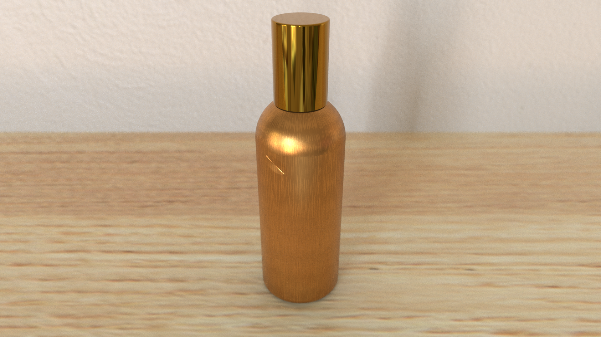
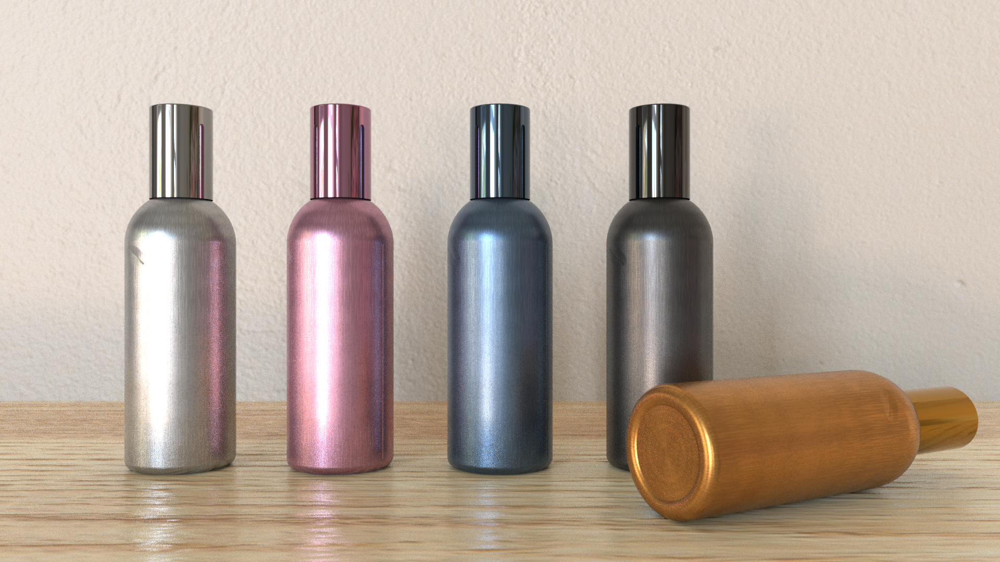

# Render Project




Generate photo-realistic rendered images of scenes containing perfume bottles using RenderMan and Python API.

Final images were generated by the python scripts using Python version 3.7.12.

Report can be found [here](report.pdf)

## File structure
- perfume.py - Generates version 1 image. This file contains functions to generate the perfume bottle, environment and lighting.
- perfume2.py - Generates version 2 image.
- shader.osl - Shader for all texture and variations.
- shader.oso - Compiled shader generated by ```oslc shader.osl``` command.
- report.pdf - Project Report.
- render/ - Contains final images in png and exr.
- env/ - Contains the HDRI used for the project.
- textures/ - Contains the tx files used for texturing the objects.